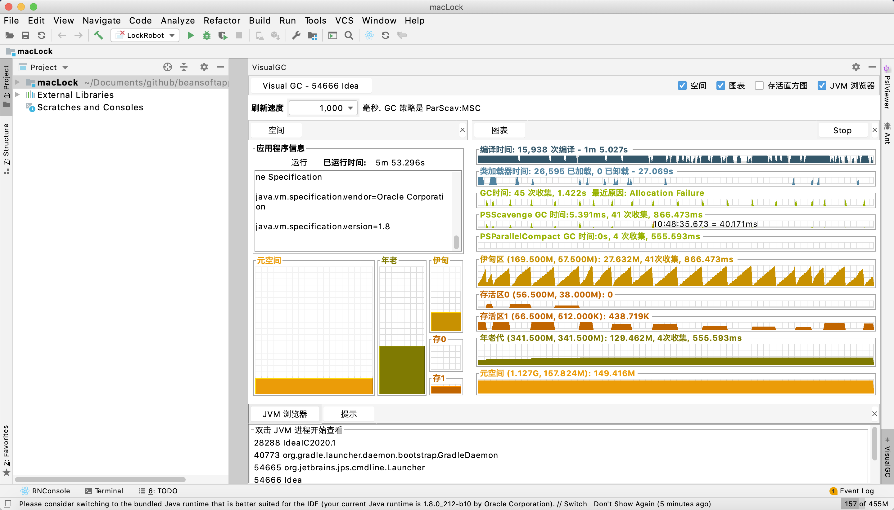

# visualgc_idea
 An IDEA plugin which displays a Visual GC tool window inside your IDE.

Usage: 

1) From main interface bottom right;

2) From menu Tools > New VisualGC Window.

在IDEA中显示 VisualGC 工具窗口, 便于一边运行代码一边观察GC情况.

用法:

1) 停靠窗口右下角的 * VisualGC;

2) 打开新的独立运行窗口使用菜单 Tools > New VisualGC Window.

如果需要在IDEA之外单独运行, 请移步: https://github.com/beansoftapp/visualgc_jdk8

Screenshot:

